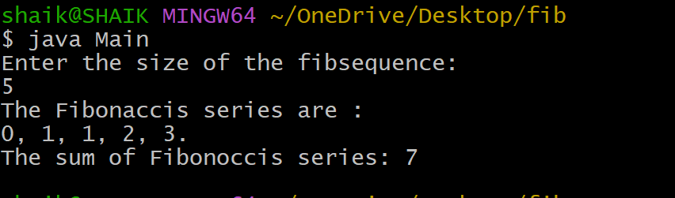

## EXPERIMENT 2:
## Title : To find the sum of the first n Fibonacci numbers>
## Source code:
``` java
class Fibonacci{
  int firstNumber;
  int secondNumber;
  int thirdNumber;
  int sum;
  int sizeoffibsequence;
  Fibonacci(int size){
    firstNumber = 0;
    secondNumber = 1;
    thirdNumber = 0;
    sum = 0;
    sizeoffibsequence=size;
  }
  void generateFibSequence(){
    while(sizeoffibsequence>0){
      if(sizeoffibsequence==1)
        System.out.print(firstNumber +".");
      else
        System.out.print(firstNumber + ", ");
        sum+=firstNumber;
        thirdNumber=secondNumber+firstNumber;
        firstNumber=secondNumber;
        secondNumber=thirdNumber;
        sizeoffibsequence--;
    }
  }
  int getFibSum(){
    if(sum>0)
      return sum;
    else{
      generateFibSequence();
      return sum;
    }
  }
}
              
import java.util.Scanner;
class Main{
  public static void main(String args[]){
    System.out.println("Enter the size of the fibsequence:");
    Scanner sc=new Scanner(System.in);
    int size=sc.nextInt();
    if(size>0){
      Fibonacci fib = new Fibonacci(size);
      System.out.println("The Fibonaccis series are : ");
      fib.generateFibSequence();
      System.out.println("\nThe sum of Fibonoccis series: " + fib.getFibSum());
    }
    else
    System.out.println("if cannot caluclate the Fibonoccis series and sum");
  }
}
```
## Output:

