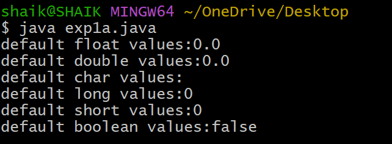

## Experiment:1
## Title: 1a) Displaying Default Primitive Types
## Source code:
``` java
 class DisplayDefaultPrimitiveType{
   int PrimInt;
   double PrimDouble;
   float PrimFloat;
   char PrimChar;
   long PrimLong;
   short PrimShort;
   boolean PrimBoolean;
   public static void main(String[] args){
     DisplayDefaultPrimitiveType dDPT=new DisplayDefaultPrimitiveType();
     System.out.println("default float values:" +dDPT.PrimFloat);
     System.out.println("default double values:" +dDPT.PrimDouble);
     System.out.println("default char values:" +dDPT.PrimChar);
     System.out.println("default long values:" +dDPT.PrimLong);
     System.out.println("default short values:"+dDPT.PrimShort);
     System.out.println("default boolean values:"+dDPT.PrimBoolean);
   }
 ```
## Output:



                             
