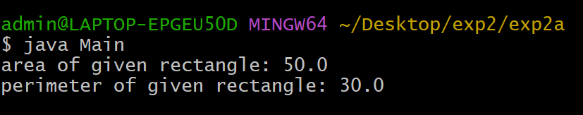
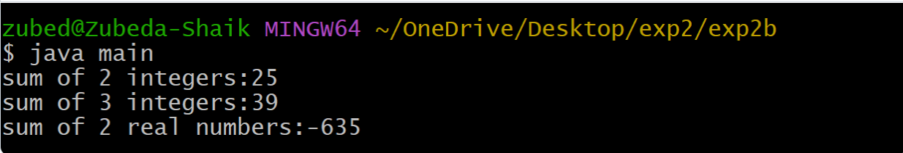

## EXPERIMENT-2
# 2a)title Implement class mechanism im java.create a class,methods and invoke them inside method.
# SORCE CODE:
``` java
public class Rectangle{
   double length;
   double breadth;
 double area(){
   return length*breadth;
 }
  double perimeter(){
    return 2*(length+breadth);
 }
}
class Main {
    public static void main (String args[]){
    Rectangle rect = new Rectangle();
     rect.length = 10;
     rect.breadth = 5;
   double area = rect.area();
   double perimeter = rect.perimeter();
   System.out.println("area of given rectangle: "+area);
   System.out.println("perimeter of given rectangle: "+perimeter);
   }
 }
```
 ## output:
 

# 2b)Write a java program to implement method overloading.
# source code:
``` java
public class Sum{
  int Sum(int a,int b){
   return a+b;
  }
  int Sum(int a,int b,int c){
   return a+b;
  }
  double Sum(double a,double b){
   return a+b;
  }
 }
class Main{
  public static void main(String args[]){
  Sum S = new Sum();
  System.out.println("Sum of the 2 integers: " +S.Sum(36,46));
  System.out.println("Sum of 3 integers: "+S.Sum(20,36,46));
  System.out.println("Sum of two real number: "+S.Sum(30.465,15.675));
  }
 }
```
## output:

